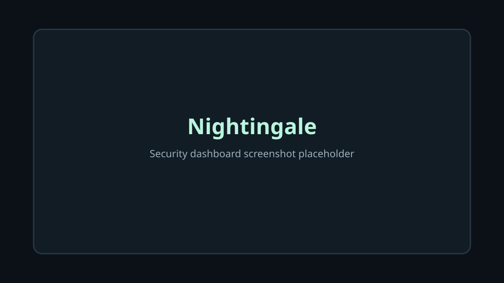

# Nightingale

Nightingale은 Windows 11과 macOS를 위한 로컬 우선 방어형 보안 모니터입니다. 사용자가 선택한 폴더의 활동과 시스템 상태를 기록·분석해 설명 가능한 위험 신호, Incident, 보안 점수를 제공합니다. 상용 백신을 대체하지 않으며 파일을 자동으로 삭제·격리·종료하지 않습니다.



## 주요 기능

- 시스템·프로세스 상태 확인 및 선택한 폴더의 재귀 파일 감시
- SHA-256 기준선 기반 무결성 신호와 규칙 기반 Threat Detection
- Incident 상관관계, severity, Security Score, 내부 알림
- 설정 영속화, 로그 검색·보관 기간 정책, JSON Security Report
- 로컬 SQLite 저장소, WAL·busy timeout·조회 인덱스를 통한 장시간 실행 안정성

## 설치 및 실행

### 최종 사용자

1. GitHub Releases에서 운영체제에 맞는 패키지를 내려받습니다.
2. macOS는 DMG에서 `Nightingale.app`을 Applications로 옮기고 실행합니다. 보호 폴더 감시에는 파일 접근 권한을 허용해야 합니다.
3. Windows는 MSI 또는 NSIS 설치 프로그램을 실행합니다.

현재 배포 서명·notarization은 준비 문서만 제공하며, 실제 공개 Release 전에는 해당 절차를 완료해야 합니다.

### 개발 환경

- Node.js 22 이상과 npm
- Rust stable 1.77.2 이상 (`rustfmt`, `clippy` 포함)
- macOS: Xcode Command Line Tools
- Windows: Visual Studio C++ Build Tools와 WebView2 Runtime

```sh
git clone https://github.com/kdh1123/Nightingale.git
cd Nightingale
npm install
npm run tauri dev
```

`npm run dev`는 웹 UI만 실행합니다. Tauri command와 파일 감시는 `npm run tauri dev`에서 사용합니다.

## 빌드와 테스트

```sh
npm run typecheck && npm run lint && npm run test && npm run build
cd src-tauri && cargo fmt --check && cargo check && cargo clippy --all-targets --all-features -- -D warnings && cargo test
```

현재 플랫폼에서 Release bundle을 만들려면 다음을 사용합니다.

```sh
npm run tauri:build:release  # macOS: .app, .dmg
npm run tauri:build:windows  # Windows: .msi, NSIS installer
```

## 프로젝트 구조

```text
src/                 React feature-first UI
src-tauri/src/domain/       정책과 모델
src-tauri/src/application/ 유스케이스
src-tauri/src/repository/  SQLite 저장소
src-tauri/src/platform/    OS adapter
src-tauri/src/tauri_api/   Tauri command 경계
docs/                     아키텍처, 보안, 플랫폼·배포 문서
```

## 알려진 제한사항

- macOS 보호 폴더에는 사용자 파일 접근 권한이 필요합니다.
- Windows 파일 watcher·번들은 Windows 실기기와 CI에서 추가 검증이 필요합니다.
- 높은 빈도의 대량 파일 변경에서는 OS watcher 버퍼가 포화되어 이벤트가 누락될 수 있습니다.
- Threat Detection은 설명 가능한 규칙 기반 신호이며 악성 행위를 확정하지 않습니다.

## 라이선스

[MIT License](LICENSE)를 사용합니다. 배포·서명·notarization 절차는 [Release 문서](docs/release-and-signing.md)를 참고하세요.
